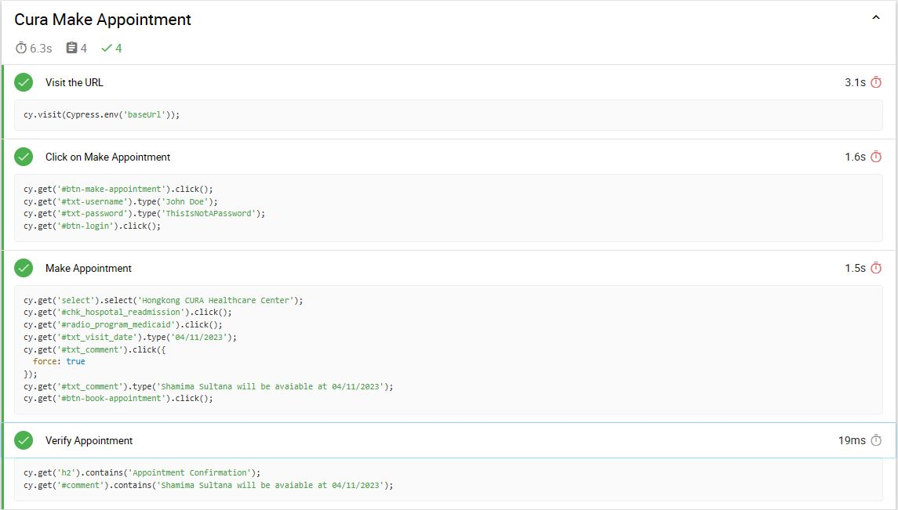

# Web Automation using Cypress on CURA Healthcare Service

## Description

This repository contains end-to-end (E2E) tests for the CURA Healthcare Center web application using Cypress. These tests are designed to automate various scenarios  and ensure the functionality and reliability of the CURA Healthcare Center website.
## Table of Contents

- [Project Overview](#project-overview)
- [Test Report](#Test-Report)
- [Prerequisit](#Prerequisit)
- [Running Tests](#running-tests)
- [Customization](#customization)

## Project Overview

The main goal of this project is to thoroughly test the CURA Healthcare Center web application using Cypress. The tests included in this repository cover various aspects of the application.
Tasks Done

- **Visiting the Website**: Ensuring successful navigation to the CURA Healthcare Center website.
- **User Authentication**: Verifying user authentication and login functionality.
- **Appointment Booking**: Automating the process of making an appointment.
- **Confirmation**: Confirming and validating appointments.

## Test Report
The test result of all the tasks done for the CURA Healthcare Center websites is given below.



## Prerequisit

Before you begin, make sure you have the following prerequisites installed on your local machine:

- [Node.js](https://nodejs.org/)
- [Cypress](https://www.cypress.io/)

**Note**: This project is designed to work with Cypress versions less than 10.
## Running Tests

To run the Cypress tests, follow these steps:

1. Clone this repository to your local machine:

   ```bash
   git clone https://github.com/ShamimaSultanaMiley/Cypress-Project-1.git
   ```

2. Change into the project directory:

   ```bash
   cd cypress-cura-healthcare
   ```

3. Install the project dependencies:

   ```bash
   npm install
   ```
4. **Install Mocha and Mocha-Awesome**: Install Mocha and Mocha-Awesome as development dependencies for this project:

   ```bash
   npm install mocha mocha-awesome --save-dev
   ```

5. **Adjust PowerShell Execution Policy**: Set the PowerShell execution policy to "RemoteSigned" to allow script execution by running the following command in an elevated PowerShell session:

   ```powershell
   Set-ExecutionPolicy RemoteSigned
   ```

6. you can run the tests using the following command:

```bash
cypress run --env baseUrl="https://katalon-demo-cura.herokuapp.com/" --spec cypress\integration\examples\cura.spec.js --browser=edge
```

This command will run your Cypress tests in the Edge browser, using the specified test file and base URL.
```

## Customization

You can customize the tests or Cypress configuration to suit your specific needs. Feel free to modify the test scripts in the test files or update the `cypress.json` configuration file.


